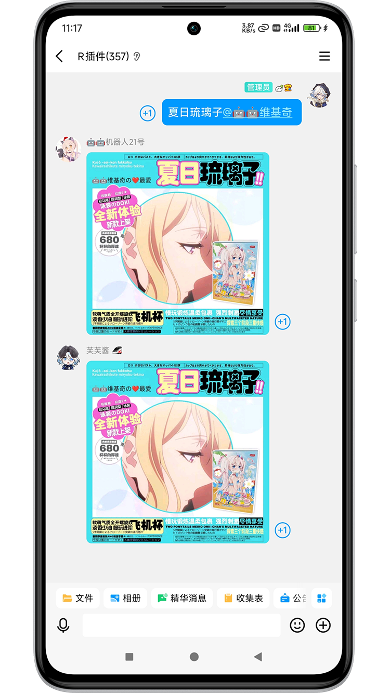

<div align="center">


<p align="center">
  
  <a href="https://crates.io/crates/meme_generator">
    
  </a>
  <a href="https://pypi.org/project/meme-generator">
    
  </a>
  <a href="https://qm.qq.com/q/DVb9aGPmaQ">
    
  </a>
</p>


## 表情包扩展仓库 meme_emoji_rust

🚀 基于 [meme-generator-rs](https://github.com/MemeCrafters/meme-generator-rs) 插件做的扩展表情包仓库

*✨* 为你的聊天机器人添加更多趣味表情生成！


## 特性

- ✅ **海量表情** 偶尔做做热门表情包，也欢迎投稿高清有趣的素材
- ⚡ **实时生成** 支持通过指令快速生成表情
- 🔄 **搭配使用** 需要搭配 [meme-generator-rs](https://github.com/MemeCrafters/meme-generator-rs) 一起使用

- ✨**搭配演示架构图所示(仅供参考)：**


## 已实现表情示例
### 简略清单
- 杯子系列 `[夏日琉璃子、琉璃子、圣修女、纪念版圣修女、限定版圣修女、对魔忍、偶像心跳、杰士邦、空气玩法]`
- OP `[名人名言大伟哥嘲笑指]`
- 芙芙指 `[芙宁娜嘲笑]`
- 表情三连 `[三连 内容]`
### 参考预览图：



## 配置信息

### 仓库文件信息

| Name                 | Attribute | Info                         |
| :------------------- | --------- | ---------------------------- |
| picture              | folder    | 说明文档图片                 |
| resources            | folder    | 表情包素材                   |
| src                  | folder    | source code                  |
| Cargo.lock           | file      | 锁定依赖的具体版本           |
| Cargo.toml           | file      | 声明依赖的版本范围           |
| LICENSE              | file      | 许可文件                     |
| meme_emoji_rust.xlsx | file      | 工作进度；普通用户可忽略     |
| paint_rsinfo.ps1     | file      | 工作脚本；普通用户可忽略     |
| README.md            | file      | 说明文档                     |
| rsinfo.txt           | file      | 工作脚本数据；普通用户可忽略 |

### Windows Config:
> 文件参考路径 C:\Users\anyliew\.meme_generator\config.toml
```bash
[meme]
load_builtin_memes = true # 是否加载内置表情包
load_external_memes = true  # 是否加载外部表情包
#true false
meme_disabled_list = []  # 禁用的表情包列表，填写表情的 `key`

[resource]
resource_url = "https://cdn.jsdelivr.net/gh/MemeCrafters/meme-generator-rs@"  # 下载内置表情包图片/字体时的资源链接
download_fonts = true  # 是否下载字体

[font]
use_local_fonts = true  # 是否使用本地文件夹下的字体
default_font_families = ["Noto Sans SC", "Noto Color Emoji"]  # 默认字体

[encoder]
gif_max_frames = 200  # 限制生成的 gif 帧数
gif_encode_speed = 1  # gif 编码速度，范围为 1 ~ 30，数字越大，编码速度越快，但图片质量越差

[api]
baidu_trans_appid = ""  # 百度翻译api相关，部分表情需要使用
baidu_trans_apikey = ""  # 可在 百度翻译开放平台 (http://api.fanyi.baidu.com) 申请

[server]
host = "0.0.0.0"  # web server 监听地址
port = 2233  # web server 端口
```


## 相关链接

- [meme-generator-rs](https://github.com/MemeCrafters/meme-generator-rs) 

- meme-generator-contrib-rs 额外表情仓库[MemeCrafters/meme-generator-contrib-rs](https://github.com/MemeCrafters/meme-generator-contrib-rs) 

## 反馈
单个表情有问题反馈请附带日志和截图

答复受限网络没那么快及时处理

> issues https://github.com/anyliew/meme_emoji_rust/issues 


## 声明

本仓库的表情素材等均来自网络，如有侵权请联系作者删除
